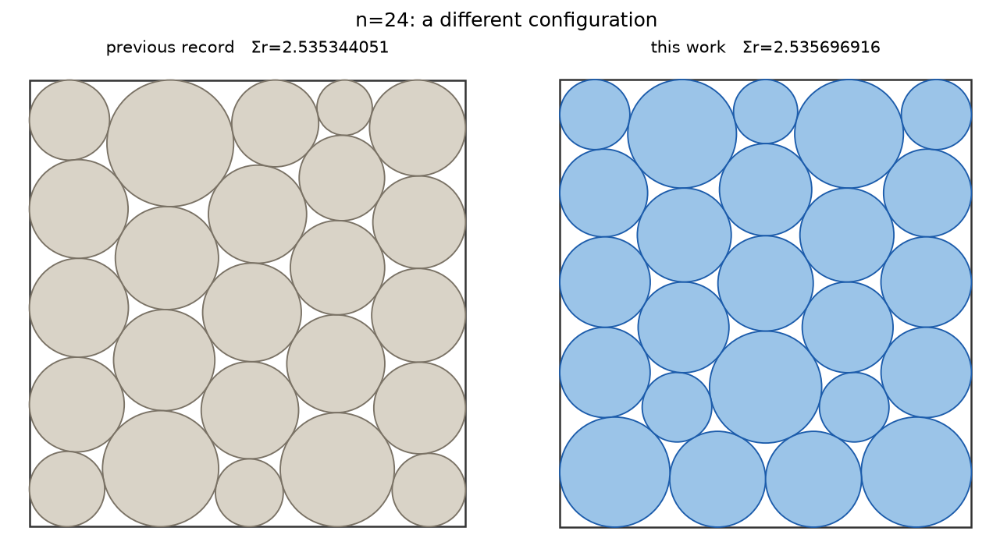
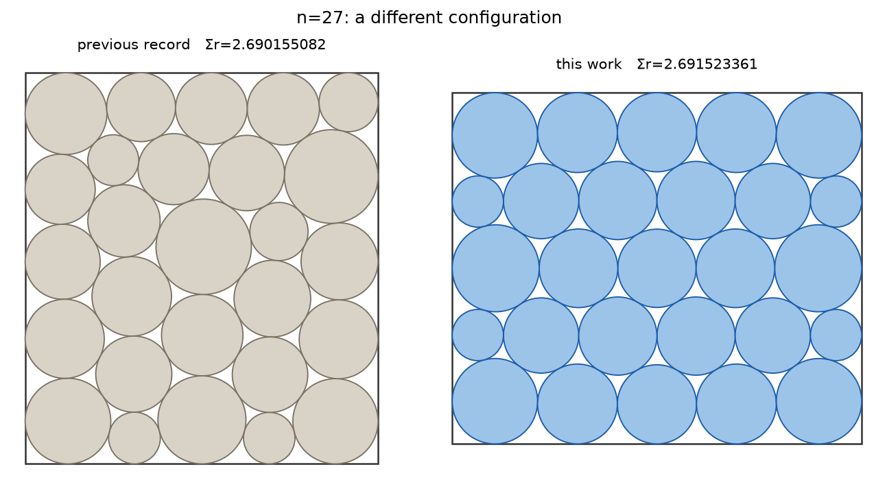
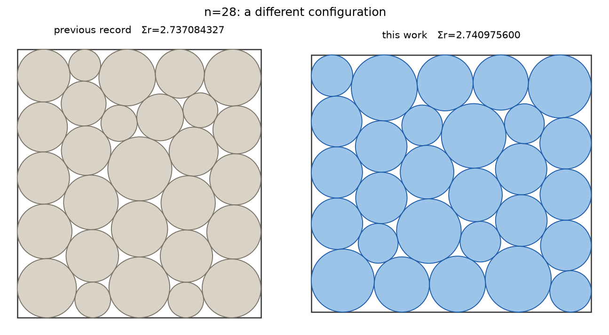
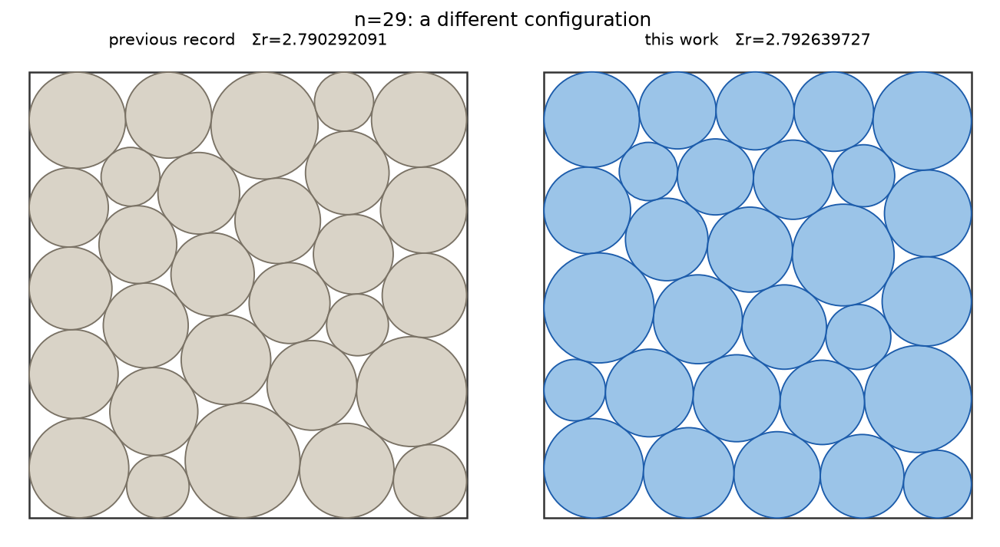
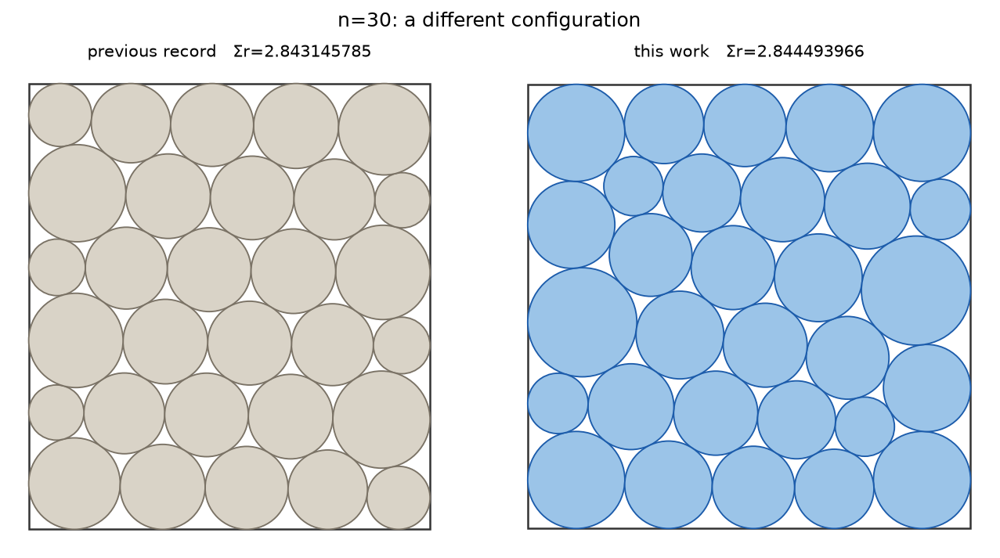
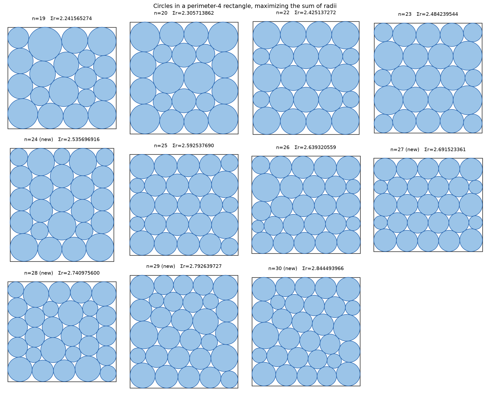

# Improved packings: circles in a perimeter-4 rectangle, maximizing the sum of radii

**Author:** Shaoheng Lai ([@lshhhhhhh](https://github.com/lshhhhhhh))
**Date:** 2026-08-17 (n=28..30 added the same day)
**Problem:** Place `n` disjoint circles (arbitrary radii) inside a rectangle of
perimeter 4 (width + height = 2, aspect ratio free) so as to maximize the sum of
the radii. Best-known values are tracked on
[Erich Friedman's packing pages](https://erich-friedman.github.io/packing/cirRrec/)
and, with full-precision coordinates, in the
[DominikKamp/Packing](https://github.com/DominikKamp/Packing) database.
The case n=21 is problem B.13 of the AlphaEvolve benchmark suite
([Novikov et al. 2025](https://storage.googleapis.com/deepmind-media/DeepMind.com/Blog/alphaevolve-a-gemini-powered-coding-agent-for-designing-advanced-algorithms/AlphaEvolve.pdf)).

## Claims

For each `n` below, `coords_n{n}.txt` contains a strictly feasible configuration
whose sum of radii strictly exceeds the value recorded in the
DominikKamp/Packing database as of 2026-08-17. Values were verified in 60-digit
arithmetic treating each decimal coordinate as exact (see *Verification*).

| n | Database record | This repository | Improvement | Nature |
|---|---|---|---|---|
| 19 | 2.241565197559671 | 2.2415652737070637 | +7.6e-08 | refinement of known configuration |
| 20 | 2.305713821106596 | 2.3057138615024604 | +4.0e-08 | refinement of known configuration |
| 22 | 2.425137224684899 | 2.4251372715445991 | +4.7e-08 | refinement of known configuration |
| 23 | 2.484239494302877 | 2.4842395442979681 | +5.0e-08 | refinement of known configuration |
| **24** | 2.535344050819014 | **2.5356969159964882** | **+3.5e-04** | **new configuration** |
| 25 | 2.592537644819718 | 2.5925376898234096 | +4.5e-08 | refinement of known configuration |
| 26 | 2.639308122181169 | 2.6393205589877593 | +1.2e-05 | tighter convergence of known configuration |
| **27** | 2.690155081571631 | **2.6915233606710185** | **+1.4e-03** | **new configuration** |
| **28** | 2.737084327032409 | **2.7409756000878951** | **+3.9e-03** | **new configuration** |
| **29** | 2.790292090706999 | **2.7926397270705987** | **+2.3e-03** | **new configuration** |
| **30** | 2.843145785181738 | **2.8444939659281285** | **+1.3e-03** | **new configuration** |

"New configuration" means the packing differs structurally from the database
entry (radius multisets differ at the 1e-2 level; optimal point-matching
distance under all rectangle symmetries exceeds 0.08). "Refinement" means the
same configuration converged more tightly; credit for those configurations
belongs to their original discoverers (David W. Cantrell; Timo Berthold et al.).

Coordinate files use the same format as the DominikKamp/Packing database:
line 1 = `n`, line 2 = sum of radii, then one `x y r` triple per line.

## Figures

The five new configurations differ visibly from the previous records:







All eight packings of this repository:



## Verification

`verify.py` is self-contained (only dependency: [mpmath](https://mpmath.org/))
and checks, at 60 significant digits:

1. all radii strictly positive;
2. every pair of circles disjoint: `dist(i,j) >= r_i + r_j`;
3. the minimal axis-aligned bounding rectangle satisfies `width + height <= 2`;
4. the sum of radii matches the claimed value.

```bash
pip install mpmath
python verify.py coords_n24.txt --record 2.535344050819014
python verify.py coords_n27.txt --record 2.690155081571631
# ... and likewise for the other n
```

Skeptical reviewers are encouraged to ignore `verify.py` entirely and write
their own checker from the four rules above — the coordinate files are the
entire claim.

## Method

Multi-start SLSQP with basin-hopping (16 parallel chains, adaptive perturbation),
implemented in plain Python/scipy on a desktop CPU (Ryzen 7 9800X3D). The
max-min objective is smoothed via an auxiliary variable
(`max t s.t. squared slack >= t`). Wall-clock per `n`: 1-3 minutes.
Radii in the published files are uniformly reduced by 1e-15 so that all
constraints hold strictly in exact arithmetic, not merely in float64.

The search pipeline was developed with AI assistance (Anthropic Claude Code);
the search itself uses no LLM at run time. Improvements for n=24 and n=27 are
being further refined; this repository will be updated if better values are found.

## License

Code (`verify.py`) under MIT. Coordinate data dedicated to the public domain (CC0).
